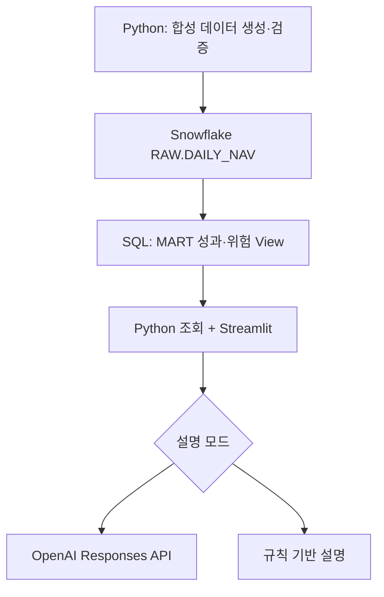
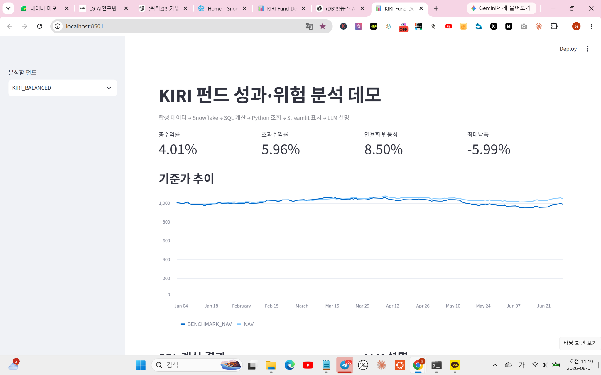
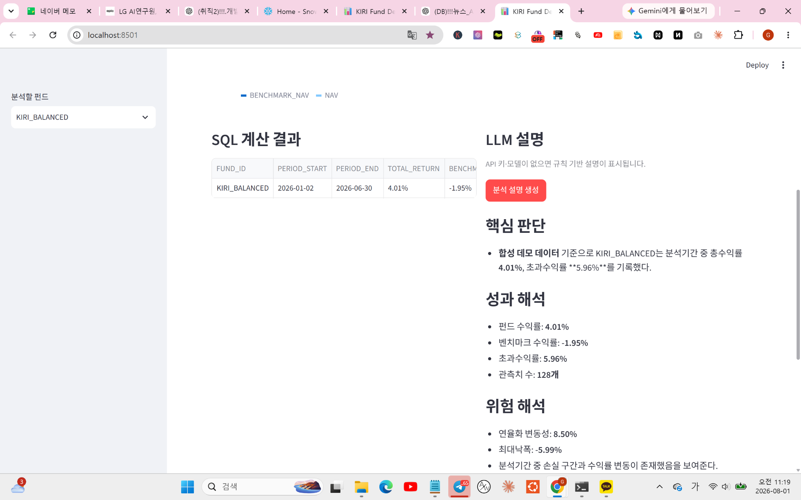

# KIRI Fund Performance & Risk Intelligence Demo

> Reproducible end-to-end data and AI demo built with Snowflake, SQL, Python, Streamlit, and the OpenAI Responses API.

가상의 펀드 일별 기준가를 생성하고, Snowflake SQL로 성과·위험지표를 계산한 뒤 Streamlit과 LLM으로 전달하는 통합 포트폴리오 프로젝트입니다.

이 프로젝트의 핵심 설계 원칙은 **수치 계산과 자연어 설명을 분리하는 것**입니다. 수익률·변동성·최대낙폭은 Snowflake SQL이 결정론적으로 계산하고, LLM은 계산된 사실을 재계산하지 않고 설명만 수행합니다.

## 핵심 파이프라인



```text
CSV 원천 데이터
→ Python 생성·검증
→ Snowflake RAW 테이블 적재
→ SQL 성과·위험지표 계산
→ Python 결과 조회
→ Streamlit 화면 표시
→ LLM 또는 규칙 기반 설명
```

## 실행 화면

### Snowflake SQL 결과를 표시하는 Streamlit 대시보드



### OpenAI Responses API 기반 분석 설명



## 이 프로젝트가 증명하는 역량

- Python을 이용한 합성 데이터 생성과 데이터 품질 검증
- Snowflake 연결, 객체 생성 및 pandas DataFrame 적재
- Window Function을 활용한 SQL 성과·위험지표 계산
- Python과 Snowflake 간 데이터 조회 계층 구현
- Streamlit 기반 대시보드와 펀드 선택 인터페이스 구현
- OpenAI Responses API 기반의 근거 제한형 설명 생성
- API 미설정·장애 상황에 대한 규칙 기반 자동 전환
- 모의 객체를 이용한 LLM 경로 자동 테스트
- 환경변수와 `.gitignore`를 이용한 비밀정보 분리

## 기술별 역할

| 계층 | 기술 | 실제 역할 |
|---|---|---|
| 원천 데이터 | CSV | 펀드·벤치마크 일별 기준가 |
| 생성·검증 | Python, pandas, NumPy | 합성 데이터 생성, 컬럼·중복·결측 검증 |
| 저장 | Snowflake | RAW 데이터 저장 |
| 변환·계산 | Snowflake SQL | 일별 수익률·초과수익률·변동성·낙폭 계산 |
| 조회 | Python, Snowflake Connector | MART View 조회 |
| 화면 | Streamlit | 지표·차트·SQL 계산 결과 표시 |
| 설명 | OpenAI Responses API | 확정된 수치의 의미를 한국어로 설명 |
| 장애 대응 | Python 규칙 엔진 | API 미설정·실패 시 설명 기능 유지 |
| 테스트 | unittest, mock | LLM 호출 없이 주요 분기 자동 검증 |

## 데이터 계층

### RAW

`KIRI_AI_DEMO.RAW.DAILY_NAV`

| 컬럼 | 의미 |
|---|---|
| `TRADE_DATE` | 거래일 |
| `FUND_ID` | 펀드 식별자 |
| `NAV` | 펀드 기준가 |
| `BENCHMARK_NAV` | 벤치마크 기준가 |

### MART

`KIRI_AI_DEMO.MART.V_DAILY_PERFORMANCE`

- 일별 펀드수익률
- 일별 벤치마크수익률
- 누적 고점
- 일별 낙폭

`KIRI_AI_DEMO.MART.V_FUND_SUMMARY`

- 분석 시작일·종료일
- 총수익률
- 벤치마크수익률
- 초과수익률
- 연율화 변동성
- 최대낙폭
- 관측치 수

## SQL 지표 정의

| 지표 | 계산 방식 |
|---|---|
| 일별 수익률 | `NAV_t / NAV_(t-1) - 1` |
| 총수익률 | `마지막 NAV / 최초 NAV - 1` |
| 벤치마크수익률 | `마지막 벤치마크 NAV / 최초 벤치마크 NAV - 1` |
| 초과수익률 | `총수익률 - 벤치마크수익률` |
| 연율화 변동성 | `STDDEV_SAMP(일별 수익률) × SQRT(252)` |
| 일별 낙폭 | `NAV / 과거 누적 최고 NAV - 1` |
| 최대낙폭 | 관측기간 일별 낙폭의 최솟값 |

LLM은 위 수치를 계산하지 않습니다. Snowflake SQL 결과를 입력받아 설명만 생성합니다.

## 실제 검증 결과

검증일: **2026-08-01**

데이터:

- 펀드 2개
- 펀드별 128개 관측치
- 전체 256행
- 분석기간: 2026-01-02 ~ 2026-06-30

| 펀드 | 총수익률 | 벤치마크수익률 | 초과수익률 | 연율화 변동성 | 최대낙폭 |
|---|---:|---:|---:|---:|---:|
| KIRI_BALANCED | 4.01% | -1.95% | 5.96% | 8.50% | -5.99% |
| KIRI_GROWTH | -2.88% | -1.95% | -0.93% | 15.34% | -15.29% |

다음 결과가 서로 일치함을 확인했습니다.

1. Python 로컬 계산
2. Snowflake SQL 계산
3. Python Snowflake 조회
4. Streamlit 화면 표시
5. LLM 설명에 포함된 수치

## 검증 환경

| 항목 | 검증 버전 |
|---|---|
| 운영체제 | Windows PowerShell |
| Python | 3.10.9 |
| pandas | 2.3.3 |
| NumPy | 2.2.6 |
| Streamlit | 1.60.0 |
| Snowflake Connector | 4.7.1 |
| OpenAI Python SDK | 2.52.0 |
| Snowflake | 10.26.102 |
| 검증 OpenAI 모델 | `gpt-5.6-sol` |

## 프로젝트 구조

```text
.
├── 01_generate_sample_data.py
├── 02_load_and_transform.py
├── 03_streamlit_app.py
├── 04_local_check.py
├── requirements.txt
├── .env.example
├── .gitignore
├── data/
│   └── .gitkeep
├── sql/
│   ├── 01_setup_objects.sql
│   └── 02_transform.sql
├── src/
│   ├── config.py
│   ├── db.py
│   └── llm.py
└── tests/
    └── test_llm.py
```

`data/daily_nav.csv`는 실행 시 재생성되며 Git 추적 대상에서 제외됩니다.

## 설치

### 1. 가상환경 생성

프로젝트 폴더에서 실행합니다.

```powershell
python -m venv .venv
Set-ExecutionPolicy -Scope Process -ExecutionPolicy Bypass
.\.venv\Scripts\Activate.ps1
```

`python`이 PATH에 없다면 설치된 Python 실행파일의 전체 경로를 사용합니다.

```powershell
& "C:\path\to\python.exe" -m venv .venv
```

### 2. 패키지 설치

```powershell
python -m pip install --upgrade pip
python -m pip install -r requirements.txt
```

설치 확인:

```powershell
python -c "import pandas, numpy, streamlit, snowflake.connector, dotenv, openai; print('환경 설치 정상')"
```

## 환경변수

공개 템플릿을 복사합니다.

```powershell
Copy-Item -LiteralPath ".env.example" -Destination ".env"
notepad ".env"
```

Snowflake 설정 예시:

```text
SNOWFLAKE_ACCOUNT=YOUR_ACCOUNT_IDENTIFIER
SNOWFLAKE_USER=YOUR_USER
SNOWFLAKE_PASSWORD=YOUR_PASSWORD
SNOWFLAKE_ROLE=SYSADMIN
SNOWFLAKE_WAREHOUSE=COMPUTE_WH
SNOWFLAKE_DATABASE=KIRI_AI_DEMO
SNOWFLAKE_SCHEMA=MART
```

주의사항:

- 계정 식별자는 로그인 URL 전체가 아닌 Snowflake account identifier를 사용합니다.
- `.env`는 Git에서 제외됩니다.
- 실제 운영환경에서는 `SYSADMIN` 대신 최소 권한 전용 역할을 사용해야 합니다.
- 이 데모 SQL은 `KIRI_AI_DEMO`, `RAW`, `MART` 객체명을 사용합니다.

## 실행 순서

### 1. 합성 데이터 생성

```powershell
python 01_generate_sample_data.py
```

정상 결과:

```text
[정상] 생성 파일: ...\data\daily_nav.csv
[정상] 행 수: 256
```

### 2. Snowflake 없이 로컬 계산 검증

```powershell
python 04_local_check.py
```

정상 결과:

```text
KIRI_BALANCED  총수익률 4.01%, 초과수익률 5.96%
KIRI_GROWTH    총수익률 -2.88%, 초과수익률 -0.93%
```

### 3. Snowflake 적재 및 SQL 변환

```powershell
python 02_load_and_transform.py
```

처리 내용:

1. Database·Schema·RAW Table 생성
2. 기존 데모 데이터 삭제
3. pandas DataFrame 256행 적재
4. 일별 성과·낙폭 View 생성
5. 펀드별 요약 View 생성
6. 계산 결과 조회

### 4. Streamlit 실행

```powershell
python -m streamlit run 03_streamlit_app.py
```

로컬 주소:

```text
http://localhost:8501
```

종료: `Ctrl+C`

## LLM 설명 모드

### 모드 1: API 키·모델 미설정

규칙 기반 설명을 사용합니다. Snowflake–SQL–Python–Streamlit 흐름은 API 비용 없이 검증할 수 있습니다.

### 모드 2: OpenAI API 정상

`OPENAI_API_KEY`와 `OPENAI_MODEL`이 존재하면 Responses API를 호출합니다.

검증된 요청 안전 설정:

```python
reasoning={"effort": "low"}
text={"verbosity": "low"}
max_output_tokens=500
store=False
```

프롬프트는 SQL이 계산한 사실만 제공하고 새로운 원인 추측이나 재계산을 금지합니다.

### 모드 3: OpenAI API 장애

인증·네트워크·사용량 관련 오류가 발생하면 앱을 중단하지 않고 규칙 기반 설명으로 자동 전환합니다.

```text
OpenAI API 오류
→ 오류 유형만 로깅
→ 규칙 기반 설명
→ Streamlit 서비스 유지
```

## OpenAI 키 보안

권장 방식:

- 프로젝트 `.env`의 `OPENAI_API_KEY`는 비워 둡니다.
- API 키는 운영체제 사용자 환경변수 또는 별도 비밀관리 도구에 저장합니다.
- `.env`와 실제 키는 Git에 추가하지 않습니다.
- 코드·README·스크린샷에 API 키를 포함하지 않습니다.

현재 PowerShell에서 Windows 사용자 환경변수에 저장된 키를 불러오는 예:

```powershell
$env:OPENAI_API_KEY=[Environment]::GetEnvironmentVariable("OPENAI_API_KEY","User")
```

모델명은 비밀정보가 아니므로 `.env`에 저장할 수 있습니다.

```text
OPENAI_MODEL=gpt-5.6-sol
```

ChatGPT 구독과 OpenAI API 사용료는 별도로 관리됩니다.

## 자동 테스트

실행:

```powershell
python -m unittest discover -s tests -v
```

검증 항목:

1. 균형형 펀드의 규칙 기반 설명
2. 성장형 펀드의 고위험 판단
3. API 설정 누락 시 API 미호출
4. 정상 API 요청의 모델·추론·출력·저장 옵션
5. API 오류 시 규칙 기반 자동 전환

정상 결과:

```text
Ran 5 tests in ...s

OK
```

테스트에서는 모의 객체를 사용하므로 OpenAI API 및 Snowflake 비용이 발생하지 않습니다.

## Snowflake 확인 SQL

```sql
SELECT COUNT(*)
FROM KIRI_AI_DEMO.RAW.DAILY_NAV;

SELECT *
FROM KIRI_AI_DEMO.MART.V_FUND_SUMMARY
ORDER BY FUND_ID;
```

정상 기준:

- `RAW.DAILY_NAV`: 256행
- `MART.V_FUND_SUMMARY`: 2행

## 주요 오류 대응

### `ModuleNotFoundError`

가상환경을 활성화하고 패키지를 다시 설치합니다.

```powershell
.\.venv\Scripts\Activate.ps1
python -m pip install -r requirements.txt
```

### Snowflake 404 연결 오류

`SNOWFLAKE_ACCOUNT`에 일부 문자열이나 로그인 URL이 아니라 정확한 account identifier가 입력됐는지 확인합니다.

### Snowflake 비밀번호 만료

Snowflake 웹 콘솔에서 비밀번호를 변경한 뒤 `.env`를 갱신합니다.

### `Insufficient privileges`

현재 역할에 Warehouse 사용, Database·Schema·Table·View 생성 또는 사용 권한이 있는지 확인합니다.

### Streamlit에 데이터 없음

```powershell
python 02_load_and_transform.py
```

### OpenAI 오류

앱은 규칙 기반 설명으로 자동 전환됩니다. 콘솔에 표시된 오류 유형을 확인한 뒤 키·모델·사용량 상태를 점검합니다.

## 보안 및 운영 원칙

- `.env` Git 제외
- API 응답 저장 비활성화(`store=False`)
- LLM 입력을 SQL 계산 결과로 제한
- 출력 토큰 상한 설정
- API 장애 시 서비스 지속
- 오류 로그에 API 키·비밀번호 미출력
- 공개 전 `git status`와 비밀정보 검사를 수행
- 실제 운영에서는 Snowflake 최소 권한 역할과 Secret Manager 사용

## 현재 한계

- 데이터는 실제 투자자료가 아닌 합성 데이터입니다.
- 펀드가 2개이고 분석기간이 약 6개월로 제한됩니다.
- 수수료·거래비용·현금흐름·포지션·위험한도는 반영하지 않습니다.
- 연율화 변동성은 연 252거래일을 가정합니다.
- `OBSERVATIONS`는 NAV 행 수이며 첫 번째 일별 수익률은 `NULL`입니다.
- Database와 Schema 명칭 일부가 SQL에 고정되어 있습니다.
- 패키지 버전이 `requirements.txt`에 고정되지 않았습니다.
- LLM 설명은 투자자문이나 투자판단을 대체하지 않습니다.

## 확장 로드맵

1. 실제 공개시장 데이터 API 연결
2. 펀드·종목·벤치마크 Dimension Table 분리
3. Snowflake 최소 권한 애플리케이션 역할 구성
4. dbt 모델·소스 테스트·문서화 추가
5. Airflow DAG 기반 적재·변환 자동화
6. GitHub Actions 기반 자동 테스트
7. Streamlit 배포와 Secret Manager 연결
8. LLM 응답 평가셋과 사실 일치율 측정
9. Calculation ID와 RAG 근거 문서 연결
10. 승인·반려·감사 이력 테이블 추가

## 면책사항

이 프로젝트는 AI·데이터 엔지니어링 역량을 설명하기 위한 합성 데이터 기반 데모입니다. 표시된 수익률과 설명은 실제 펀드나 투자성과를 의미하지 않으며 투자 권유 또는 자문으로 사용해서는 안 됩니다.
